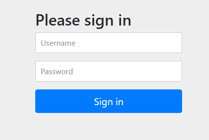

# 챕터 01 - 프로젝트 구성

### 스프링 부트 기반으로 스프링 시큐리티 프로젝트를 구성한다

시큐리티 의존성을 추가시 기본적인 보안이 적용된다.
```gradle
plugins {
	id 'org.springframework.boot' version '2.4.0'
	id 'io.spring.dependency-management' version '1.0.11.RELEASE'
	id 'java'
}

group = 'study'
version = '0.0.1-SNAPSHOT'
sourceCompatibility = '11'

configurations {
	compileOnly {
		extendsFrom annotationProcessor
	}
}

repositories {
	mavenCentral()
}

dependencies {
	implementation 'org.springframework.boot:spring-boot-starter-web'
	implementation 'org.springframework.boot:spring-boot-starter-security' // 시큐리티 의존성
	compileOnly 'org.projectlombok:lombok'
	annotationProcessor 'org.projectlombok:lombok'
	testImplementation 'org.springframework.boot:spring-boot-starter-test'
}

test {
	useJUnitPlatform()
}
```

### 프로젝트에 의존성을 추가하고 부트 기동시 콘솔에 다음과 같이 임시비밀번호가 발급된다.

```bash
Using generated security password: 735e7d0f-094c-477e-a550-e540b152daf5
```

### 시큐리티는 로그인 페이지를 설정하지 않으면 기본 로그인 페이지를 제공한다.




로그인 페이지에 임시 비밀번호를 사용할 경우
- 아이디 : user
- 비번 : 스프링 부트 실행시 콘솔창에 출력되는 임시 비밀번호