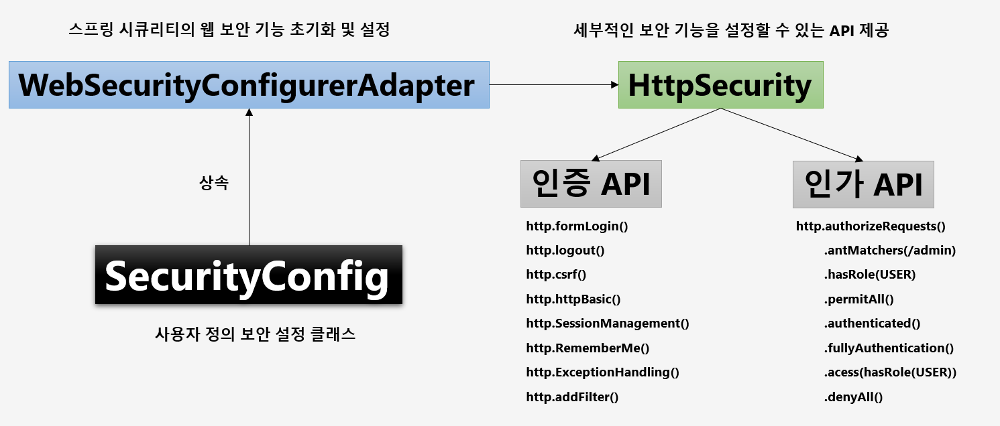
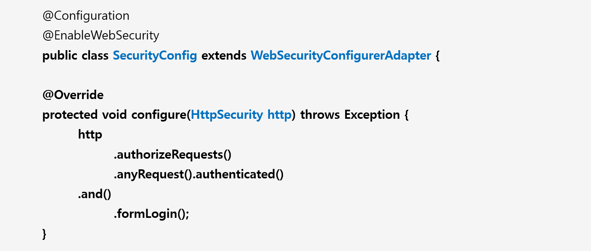

# 챕터 02 - 사용자 정의 보안 기능 구현




- 시큐리티 구성 클래스 설정
  - @Configuration
  - @EnableWebSecurity
    - 웹 보안 활성화
- 사용자 아이디와 비번 설정
  - 테스트에 사용될 사용자 아이디와 비번을 application.yml 파일에 설정가능
```yml
spring:
  security:
    user:
      name: user
      password: 1111
```

시큐리티 설정 후 로딩될 때 내부에서 WebSecurityConfigurerAdapter에서 호출되고 있다.

```java
public abstract class WebSecurityConfigurerAdapter implements WebSecurityConfigurer<WebSecurity> {

  // ...
	@SuppressWarnings({ "rawtypes", "unchecked" })
	protected final HttpSecurity getHttp() throws Exception {
		if (this.http != null) {
			return this.http;
		}
		AuthenticationEventPublisher eventPublisher = getAuthenticationEventPublisher();
		this.localConfigureAuthenticationBldr.authenticationEventPublisher(eventPublisher);
		AuthenticationManager authenticationManager = authenticationManager();
		this.authenticationBuilder.parentAuthenticationManager(authenticationManager);
		Map<Class<?>, Object> sharedObjects = createSharedObjects();
		this.http = new HttpSecurity(this.objectPostProcessor, this.authenticationBuilder, sharedObjects);
		if (!this.disableDefaults) {
			applyDefaultConfiguration(this.http); // 설정 초기화 작업 처리
			ClassLoader classLoader = this.context.getClassLoader();
			List<AbstractHttpConfigurer> defaultHttpConfigurers = SpringFactoriesLoader
					.loadFactories(AbstractHttpConfigurer.class, classLoader);
			for (AbstractHttpConfigurer configurer : defaultHttpConfigurers) {
				this.http.apply(configurer);
			}
		}
		configure(this.http);
		return this.http;
	}

  // 설정 초기화 작업 처리
  private void applyDefaultConfiguration(HttpSecurity http) throws Exception {
		http.csrf();
		http.addFilter(new WebAsyncManagerIntegrationFilter());
		http.exceptionHandling();
		http.headers();
		http.sessionManagement();
		http.securityContext();
		http.requestCache();
		http.anonymous();
		http.servletApi();
		http.apply(new DefaultLoginPageConfigurer<>());
		http.logout();
	}
  //...
  // configure를 오버라이드 하지 않으면 다음과 같이 default로 설정된 configure가 호출된다.
  // configure를 오버라이드 해서 프로그래머가 추가 설정을 구현해야 한다.
  protected void configure(HttpSecurity http) throws Exception {
		this.logger.debug("Using default configure(HttpSecurity). "
				+ "If subclassed this will potentially override subclass configure(HttpSecurity).");
		http.authorizeRequests((requests) -> requests.anyRequest().authenticated());
		http.formLogin();
		http.httpBasic();
	}
//...
}
```

configure 메소드를 간략하게 구현한 예제를 설명하면 다음과 같다.
```java
@Configurable
@EnableWebSecurity
public class SecurityConfig extends WebSecurityConfigurerAdapter {
    
    @Override
    protected void configure(HttpSecurity http) throws Exception {
        /*
         * 인가 정책 부
         */
        http.authorizeRequests() // 요청에 대한 보안 검사를 시작하고
            .anyRequest().authenticated(); // 어떠한 요청에도 인증을 하겠다는 의미
        
        /*
         * 인증 정책 부
         */
        http.formLogin(); // 폼 로그인 인증 사용
    }
}
```