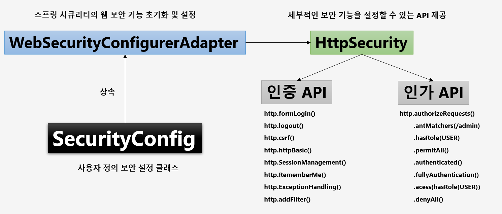
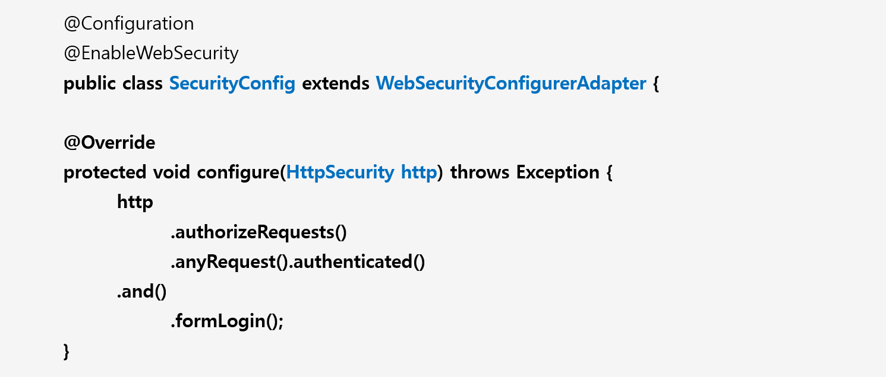

# 챕터 02 - 사용자 정의 보안 기능 구현



- 시큐리티 구성 클래스 설정
  - @Configuration
  - @EnableWebSecurity
    - 웹 보안 활성화
- 사용자 아이디와 비번 설정
  - 테스트에 사용될 사용자 아이디와 비번을 application.yml 파일에 설정가능
```yml
spring:
  security:
    user:
      name: user
      password: 1111
```