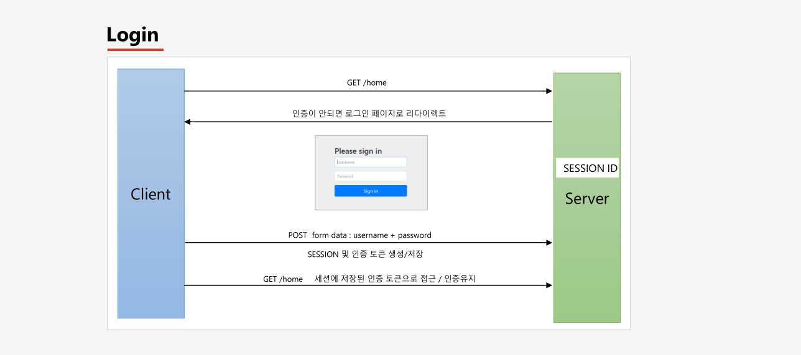
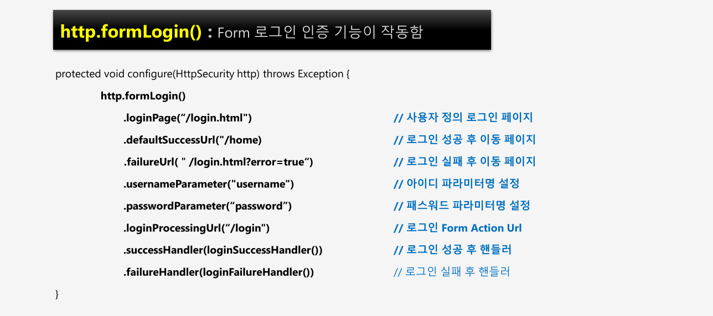

# 챕터 03 - 폼(form)로그인 인증




아이디 파라미터와 패스워드 파라미터의 의미는 form 태그를 통해서 넘어오는 아이디와, 패스워드가 매핑된 파라미터 명이다.
```html
<form action="<send request data to loginProcessingUrl>">
    <input type="text" name="username">
    <input type="password" name="password">
</form>
```
  
폼 로그인을 위한 시큐리티 구성클래스의 코드는 다음과 같다.
```java

@Configurable
@EnableWebSecurity
public class SecurityConfig extends WebSecurityConfigurerAdapter {

    @Override
    protected void configure(HttpSecurity http) throws Exception {
        http.authorizeRequests() // 보안 검사
                .anyRequest().authenticated(); // 어떠한 요청에도 인증을 하겠다는 의미

        http.formLogin()
                .loginPage("/loginPage") // login 페이지가 표시되는 URL 설정 - 커스텀 로그인 페이지를 구현했을 경우 설정한다 (디폴트값은 /login)
                .defaultSuccessUrl("/")  // login 성공시 이동할 URL 설정
                .failureUrl("/loginPage") // login 실패 후 이동할 URL 설정
                .usernameParameter("userId") // 설정안할시 디폴트는 username
                .passwordParameter("passwd") // 설정안할시 디폴트는 password
                .loginProcessingUrl("/login_proc") // form 태그의 action 애트리뷰트에 설정하는 URL

                //로그인 성공시 처리할 핸들러 설정
                .successHandler(new AuthenticationSuccessHandler() {

                    @Override
                    public void onAuthenticationSuccess(HttpServletRequest request, HttpServletResponse response,
                            Authentication authentication) throws IOException, ServletException {
                        System.out.println("login Success user id : " + authentication.getName());
                        response.sendRedirect("/"); // 인증 성공 후 "/"로 이동
                    }
                })
                
                //로그인 실패시 처리할 핸들러
                .failureHandler(new AuthenticationFailureHandler() {

                    @Override
                    public void onAuthenticationFailure(HttpServletRequest request, HttpServletResponse response,
                            AuthenticationException exception) throws IOException, ServletException {
                        System.out.println("exception : " + exception.getMessage());
                        response.sendRedirect("/loginPage"); // 인증 실패 후 "/loginPage"로 이동
                    }
            })
            .permitAll(); // 로그인 페이지( .loginPage() 통해서 설정 )는 누구나 접근가능해야 하므로(인증을 받지 않아도 접근해야 로그인이 가능하다)
    }
}
```