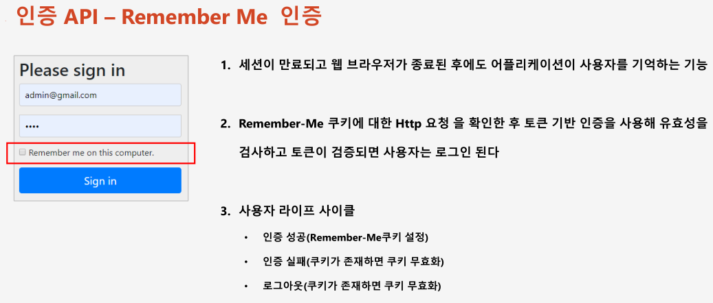
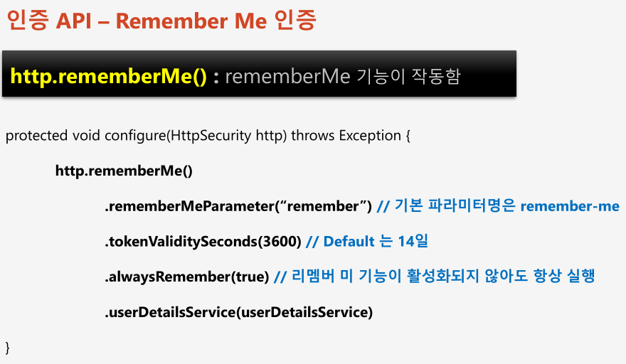
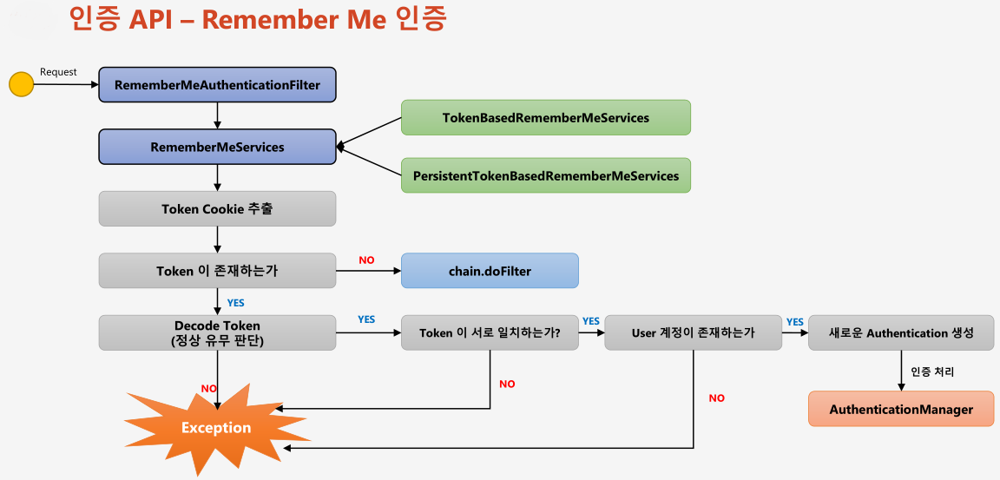
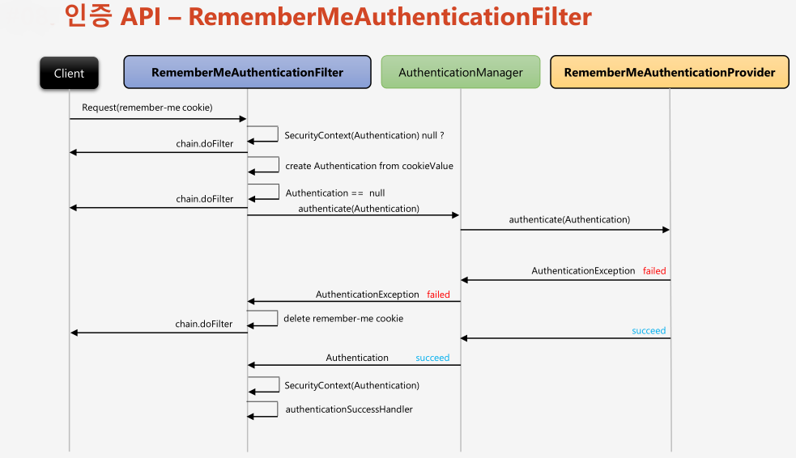

# 챕터 06 - Remember me 인증


 

  
- TokenBasedRememberMeServices : 메모리에 저장된 토큰과 사용자 쿠키의 토큰과 비교해서 인증처리
- PersistentTokenBasedRememberMeServices : 데이버베이스에 저장된 토큰과 사용자 쿠키의 토큰과 비교해서 인증처리  
  


### 리멤버미 인증 설정
리멤버미 인증을 다음과 같이 구성 클래스에 설정할 수 있다.  
```java
package study;

import java.io.IOException;

import javax.servlet.ServletException;
import javax.servlet.http.HttpServletRequest;
import javax.servlet.http.HttpServletResponse;
import javax.servlet.http.HttpSession;

import org.springframework.beans.factory.annotation.Autowired;
import org.springframework.beans.factory.annotation.Configurable;
import org.springframework.security.config.annotation.web.builders.HttpSecurity;
import org.springframework.security.config.annotation.web.configuration.EnableWebSecurity;
import org.springframework.security.config.annotation.web.configuration.WebSecurityConfigurerAdapter;
import org.springframework.security.core.Authentication;
import org.springframework.security.core.AuthenticationException;
import org.springframework.security.core.userdetails.UserDetailsService;
import org.springframework.security.web.authentication.AuthenticationFailureHandler;
import org.springframework.security.web.authentication.AuthenticationSuccessHandler;
import org.springframework.security.web.authentication.logout.LogoutHandler;

@Configurable
@EnableWebSecurity
public class SecurityConfig extends WebSecurityConfigurerAdapter {

    @Autowired
    private UserDetailsService userDetailsService;

    @Override
    protected void configure(HttpSecurity http) throws Exception {
        http.authorizeRequests() // 보안 검사
                .anyRequest().authenticated(); // 어떠한 요청에도 인증을 하겠다는 의미

        /**
         *  폼 로그인 처리
         */
        http.formLogin()
                // .loginPage("/loginPage") // login 페이지가 표시되는 URL 설정
                .defaultSuccessUrl("/")  // login 성공시 이동할 URL 설정
                // .failureUrl("/loginPage") // login 실패 후 이동할 URL 설정
                .usernameParameter("userId") // 설정안할시 디폴트는 username
                .passwordParameter("passwd") // 설정안할시 디폴트는 password
                .loginProcessingUrl("/login_proc") // form 태그의 action 애트리뷰트에 설정하는 URL

                //로그인 성공시 처리할 핸들러 설정
                .successHandler(new AuthenticationSuccessHandler() {

                    @Override
                    public void onAuthenticationSuccess(HttpServletRequest request, HttpServletResponse response,
                            Authentication authentication) throws IOException, ServletException {
                        System.out.println("login Success user id : " + authentication.getName());
                        response.sendRedirect("/"); // 인증 성공 후 "/"로 이동
                    }
                })
                
                //로그인 실패시 처리할 핸들러
                .failureHandler(new AuthenticationFailureHandler() {

                    @Override
                    public void onAuthenticationFailure(HttpServletRequest request, HttpServletResponse response,
                            AuthenticationException exception) throws IOException, ServletException {
                        System.out.println("exception : " + exception.getMessage());
                        response.sendRedirect("/login"); // 인증 실패 후 "/login"으로 이동
                    }
            })
            .permitAll() // 로그인 페이지( .loginPage() 통해서 설정 )는 누구나 접근가능해야 하므로(인증을 받지 않아도 접근해야 로그인이 가능하다)

        /**
         *  폼 로그아웃 처리 
         *  클라이언트에서 GET 방식이 아닌 POST 방식으로 로그아웃 처리 요청을 보내야한다.
         */
        .and().logout()
            .logoutUrl("/logout") // 로그아웃 URL 설정 아무 것도 설정하지 않으면 기본으로 /logout으로 설정됨
            .logoutSuccessUrl("/login") // 로그아웃 성공시 이동할 URL
            .addLogoutHandler(new LogoutHandler(){ // 로그아웃시 처리할 핸들러 등록
                @Override
                public void logout(HttpServletRequest request, HttpServletResponse response,
                        Authentication authentication) {
                    HttpSession session =  request.getSession();
                    session.invalidate();
                }
            })
            // 로그아웃 성공시 처리할 핸들러 등록 (LogoutSuccessHandler 인터페이스 사용));
            .logoutSuccessHandler((request, response, authentication) ->  response.sendRedirect("/login"))

            // 로그아웃시 제거할 쿠키명들을 선언
            .deleteCookies("JSESSIONID", "remember-me")
        
        /** 
         * 리멤버미 인증 처리
         */
        .and().rememberMe()
            .rememberMeParameter("remember-me")
            .tokenValiditySeconds(3450) // 3450초 = 1시간

            // 리멤버미 사용할때 시스템에 있는 사용자 계정 조회처리하는 과정이 있는데 그러한 처리를 담당하는 서비스를 지정한다. - 필수!!!
            .userDetailsService(userDetailsService); 

    }
}

```
