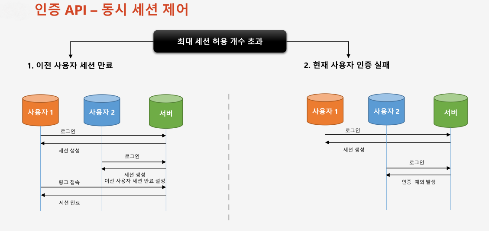
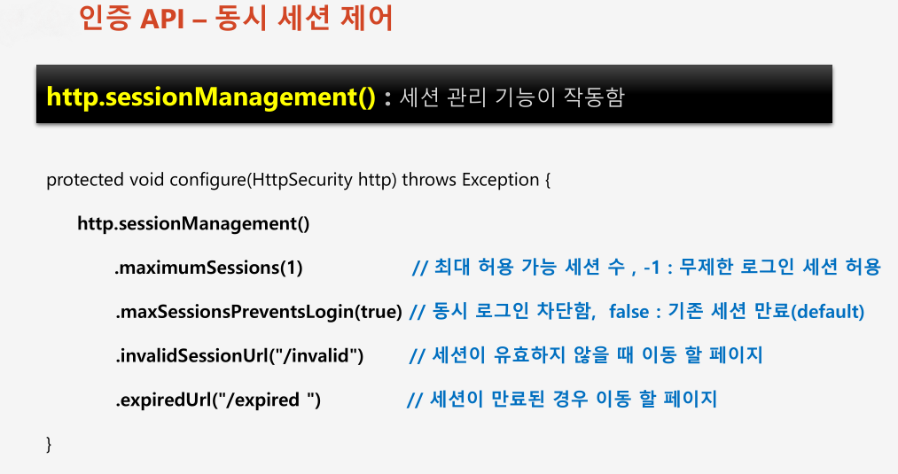
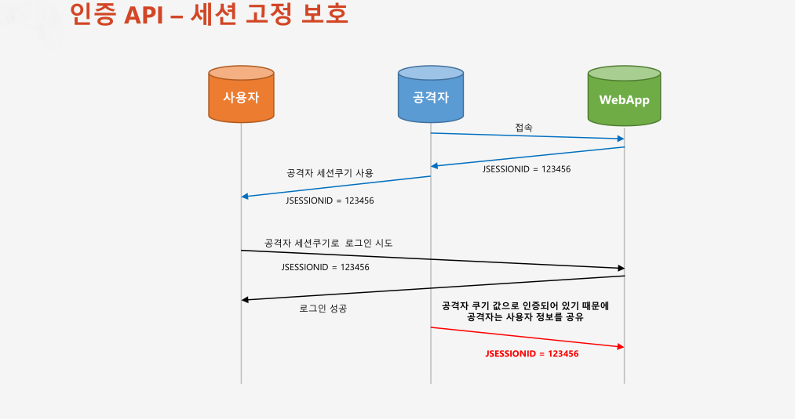
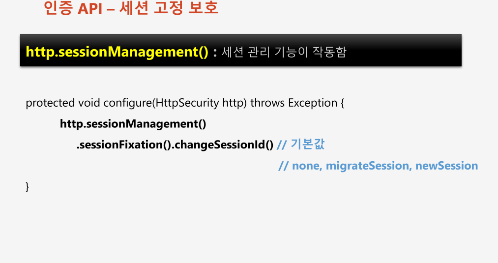
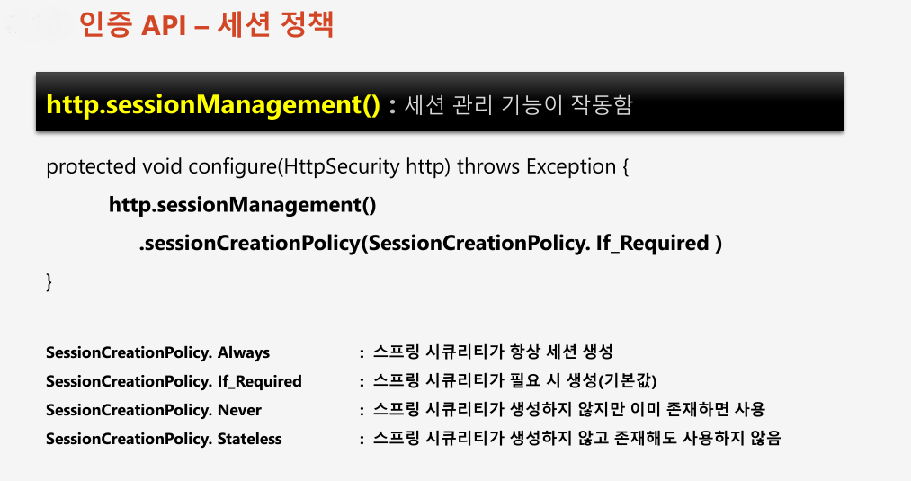

# 챕터 08 - 동시세션제어, 세션고정보호, 세션정책

동일한 계정으로 인증을 받을 때 생성되는 세션의 갯수가 허용개수를 초과했을 때 어떻게 세션을 관리할 것인지 정의한다.

  
- changeSessionId() : Servlet 3.1 이상 기본값
- migrationSession() : Servlet 3.1 미만 기본값, changeSessionId()와 역할 동일
- newSession() : 이전에 매핑된 세션데이터를 완전 삭제 후 새로운 새션아이디를 발급 받고 완전한 새로운 세션 생성 
- none() : 세션아이디를 변경하지 않음
