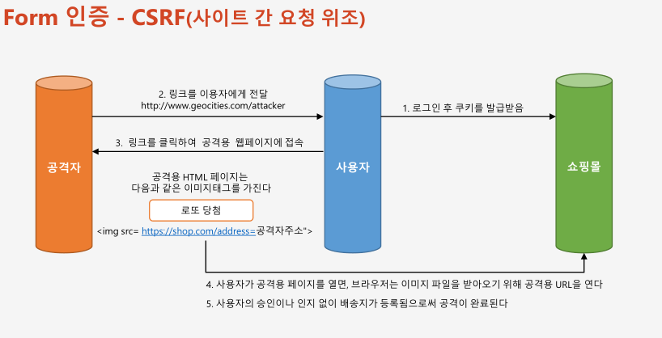
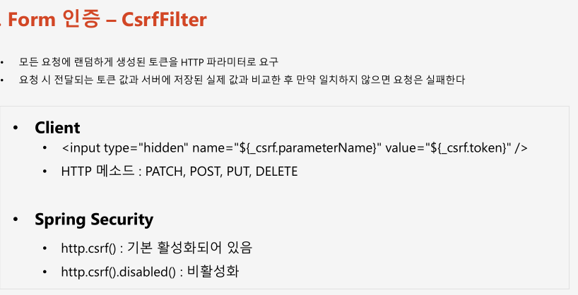

# 챕터 12 - CSRF, CsrfFilter의 이해

  

  
타임리프나 spring form 태그를 사용하는 경우에는 CSRF 토큰 값이 들어가 있지만, 일반적인 폼을 사용할 경우 직접 설정해줘야한다.

## 예제 코드 - csrf 사용하지 않기
```java

@Configurable
@EnableWebSecurity
public class SecurityConfig extends WebSecurityConfigurerAdapter {

    @Autowired
    private UserDetailsService userDetailsService;

    /**
     * 사용자 정보화 권한 정보 설정 - 여기서는 메모리 방식으로 처리
     */
    @Override
    protected void configure(AuthenticationManagerBuilder auth) throws Exception {
        // 시큐리티 5부터 암호는 평문을 사용한다는 의미를 주기위해 {noop}를 사용
        auth.inMemoryAuthentication().withUser("user").password("{noop}1111").roles("USER");
        auth.inMemoryAuthentication().withUser("sys").password("{noop}1111").roles("SYS");
        auth.inMemoryAuthentication().withUser("admin").password("{noop}1111").roles("ADMIN");
    }

    @Override
    protected void configure(HttpSecurity http) throws Exception {
        /**
         * 권한 설정 및 표현식 처리 - 선언적 방식
         */
        http.authorizeRequests()
                .antMatchers("/login").permitAll()
                .antMatchers("/user").hasRole("USER")
                .antMatchers("/sys").hasRole("SYS")
                .antMatchers("/admin/pay").hasRole("ADMIN")
                .antMatchers("/admin/**").hasAnyRole("ADMIN", "SYS")
                .anyRequest().authenticated(); // 나머지 모든 요청에 인증 받아야함
         
        http.formLogin()
        // ...생략
        
        /**
         *  CSRF 필터 비활성화 - 기본은 활성화된 상태
         */
        .and().csrf()
            .disable();
    }
}
```