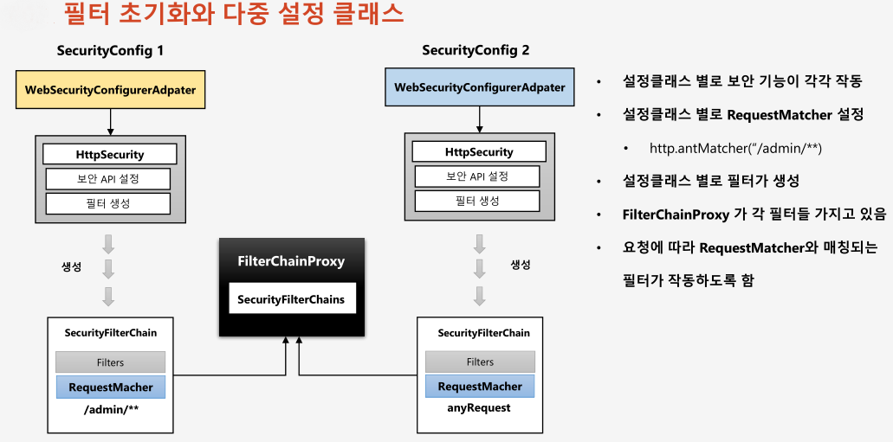
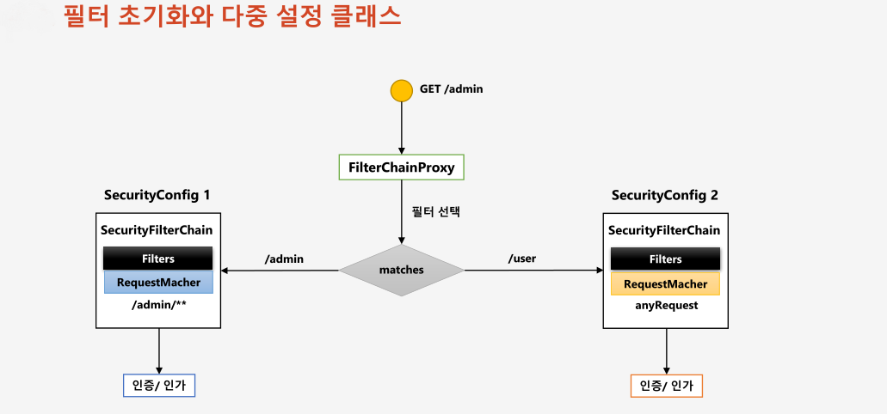
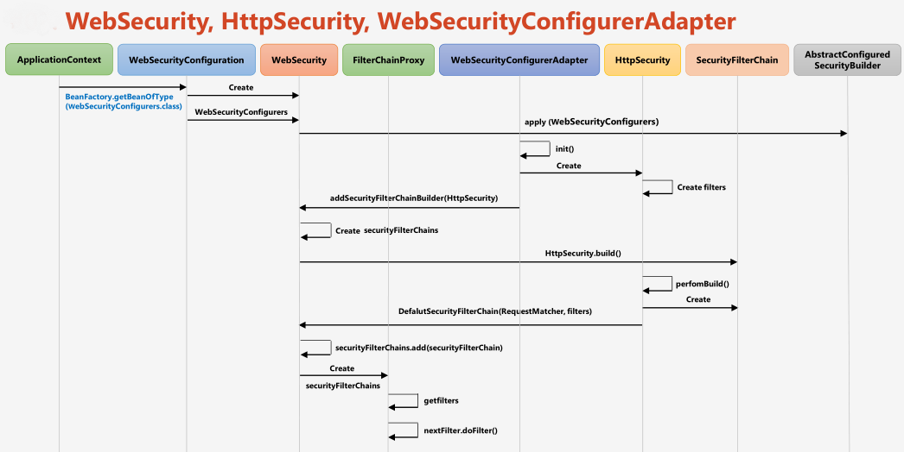
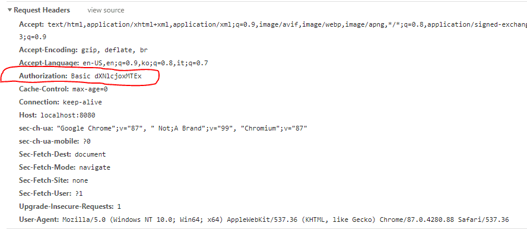

# 챕터 14 - 필터 초기화와 다중보안

  




## 다중 시큐리티 구성 클래스

http basic 인증 방식과 폼 로그인 방식으로 인증을 처리하는 두가지 구성 클래스를 선언하였다.  
http basic 인증 방식의 특징은 다음과 같다.  
- 세션이 아닌 토큰을 이용한다.
  - 서버를 재기동하거나 JSESSIONID 값이 없어도 빨간테두리의 헤더값이 존재하는 한 인증이 이루어진다.
  - base64 인코딩 방식으로 토큰이 생성되기 때문에 보안에 매우 취약하므로 SSL로 통신이 이루어져야 한다.



```java
@Configurable
@EnableWebSecurity
@Order(0) // org.springframework.beans.factory.BeanCreationException: ... @Order on WebSecurityConfigurers must be unique 에러 방지
public class SecurityConfig1 extends WebSecurityConfigurerAdapter {

    @Override
    protected void configure(HttpSecurity http) throws Exception {
        http.antMatcher("/admin/**")
            .authorizeRequests()
            .anyRequest().authenticated() // 인증 받은 사용자만 /admin에 접근
        .and()
            .httpBasic(); //http basic 인증 방식
    }
}


@Configurable
@EnableWebSecurity
@Order(1) // org.springframework.beans.factory.BeanCreationException: ... @Order on WebSecurityConfigurers must be unique 에러 방지
public class SecurityConfig2 extends WebSecurityConfigurerAdapter {

    @Override
    protected void configure(HttpSecurity http) throws Exception {
        http.authorizeRequests()
            .anyRequest()
            .permitAll()
        .and()
            .formLogin();
    }
}
```