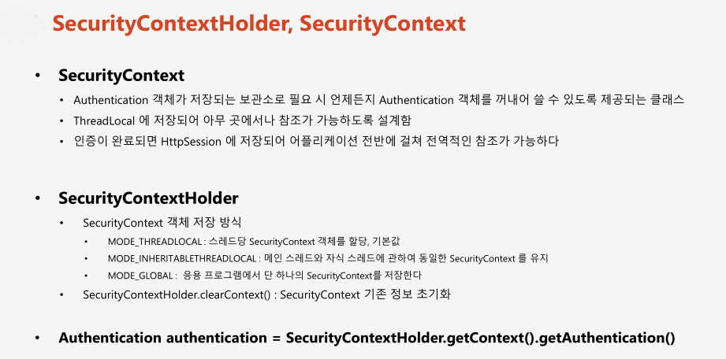
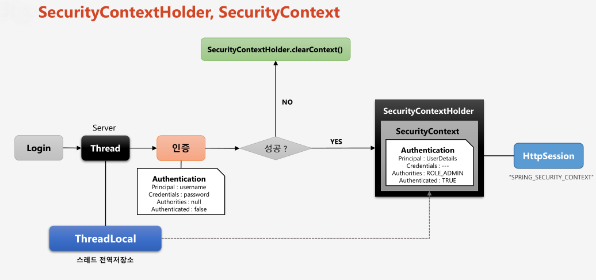

# 챕터 16 - SecurityContextHolder, SecurityContext 아키텍처의 이해

  


## SecurityContextHolder의 SecurityContext 공유 전략 설정

SecurityContextHolder에서 SecurityContext를 공유 할 때 ThreadLocal을 이용해서 데이터를 공유한다
SecurityContextHolder SecurityContext를 공유 전략은 다음과 같은 값들을 이용해 설정할 수 있다.
- SecurityContextHolder.MODE_THREADLOCAL - 현재 스레드 내에서 SecurityContext를 공유한다. (기본값)
- SecurityContextHolder.MODE_INHERITABLETHREADLOCAL - 현재 스레드에서 생성되는 자식 스레드 까지 SecurityContext를 공유한다. 
- SecurityContextHolder.MODE_GLOBAL - 스레드 전역으로 SecurityContext를 공유한다.

설정 클래스에서 SecurityContext 공유 전략을 다음과 설정 할 수 있다.
```java
@Configurable
@EnableWebSecurity
@Order(1)
public class SecurityConfig2 extends WebSecurityConfigurerAdapter {

    @Override
    protected void configure(HttpSecurity http) throws Exception {
        // ... 생략
        
        // SecurityContext 공유 전략 설정
        SecurityContextHolder.setStrategyName(SecurityContextHolder.MODE_INHERITABLETHREADLOCAL);
    }
}
```