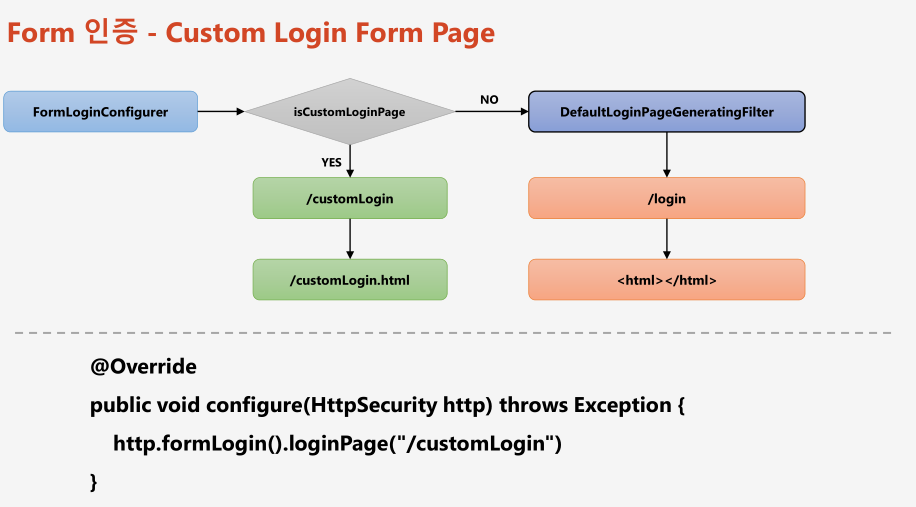

# 챕터 29 - 커스텀 로그인 페이지 생성하기


## 로그인 페이지 src/resources/template/user/login/login.html
```html
<!DOCTYPE html>
<html xmlns:th="http://www.thymeleaf.org">
<head th:replace="layout/header::userHead"></head>
<body>
<div th:replace="layout/top::header"></div>
<div class="container text-center">
    <div class="login-form d-flex justify-content-center">
        <div class="col-sm-5" style="margin-top: 30px;">
            <div class="panel">
                <p>아이디와 비밀번호를 입력해주세요</p>
            </div>
            <!-- 로그인시 인증처리는 /login_proc이 담당-->
            <form th:action="@{/login_proc}" class="form-signin" method="post">
                <input type="hidden" th:value="secret" name="secret_key" />
                <div class="form-group">
                    <input type="text" class="form-control" name="username" placeholder="아이디" required="required" autofocus="autofocus">
                </div>
                <div class="form-group">
                    <input type="password" class="form-control" name="password" placeholder="비밀번호" required="required">
                </div>
                <button type="submit" class="btn btn-lg btn-primary btn-block">로그인</button>
            </form>
        </div>
    </div>
</div>
</body>
</html>
```

## 시큐리티 구성클래스
```java
@EnableWebSecurity
public class SecurityConfig extends WebSecurityConfigurerAdapter {

    @Override
    protected void configure(AuthenticationManagerBuilder auth) throws Exception {
        auth.authenticationProvider(authenticationProvider());
    }

    @Bean
    AuthenticationProvider authenticationProvider() {
        return new CustomAuthenticationProvider();
    }

    // PasswordEncoder 빈 생성
    @Bean
    public PasswordEncoder passwordEncoder() {
        return PasswordEncoderFactories.createDelegatingPasswordEncoder();
    }
    

    @Override
    protected void configure(final HttpSecurity http) throws Exception {
        http
                .authorizeRequests()
                .antMatchers("/","/users","user/login/**","/login*").permitAll()
                .antMatchers("/mypage").hasRole("USER")
                .antMatchers("/messages").hasRole("MANAGER")
                .antMatchers("/config").hasRole("ADMIN")
                .anyRequest().authenticated()
        .and()
                .formLogin()
                .loginPage("/login") /* 로그인 페이지 이동 */
                .loginProcessingUrl("/login_proc") /* 로그인 인증처리 URL */
                .defaultSuccessUrl("/") /* 인증 성공 후 이동할 URL */
                .permitAll();
    }
}
```

## /login 경로를 의한 컨트롤러 작성
```java
@Controller
public class LoginController {
    
    @GetMapping("/login")
    public String login() {
        return "user/login/login";
    }
}
```